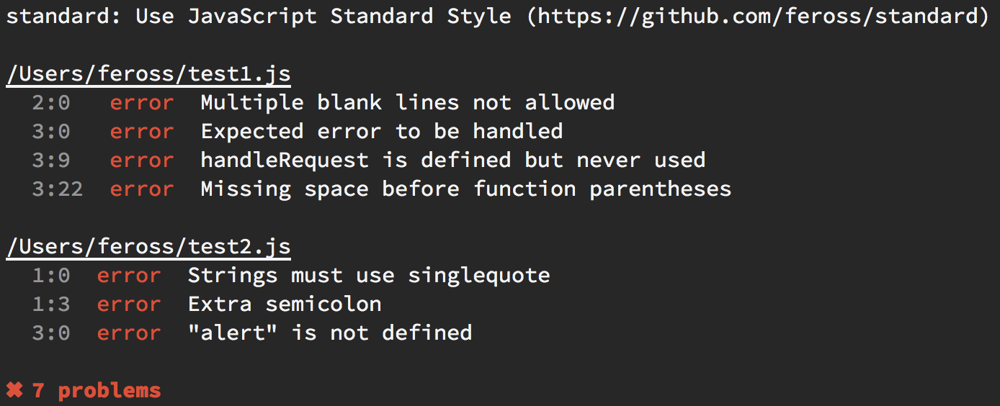

# rollup-plugin-standard

Verify imported files with [StandardJS](https://standardjs.com/)



## Usage

```bash
$ npm install rollup-plugin-standard
```

```js
// rollup.config.js
import standard from 'rollup-plugin-standard'

export default {
  entry: 'main.js',
  plugins: [ standard( /* options */ ) ]
}
```

## Options

`options.include` and `options.exclude` can each be a [minimatch](https://www.npmjs.com/package/minimatch) pattern, or an array of minimatch patterns, relative to `process.cwd()`.

## License

MIT © [Stanislav Termosa](https://github.com/termosa)

